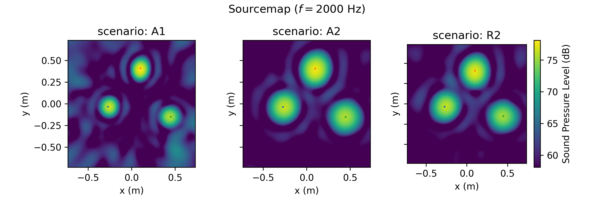

.. _dataset_miracle:

DatasetMIRACLE
==============

``DatasetMIRACLE`` is an experimental (semi-synthetic) microphone array data generator that
builds multi-source source cases by convolving synthetic source signals with **measured**
spatial room impulse responses (SRIRs) from the `MIRACLE`_ dataset. The workflow is
analogous to :class:`~acoupipe.datasets.synthetic.DatasetSynthetic`, but the propagation
operator is given by measured SRIRs instead of an analytic free-field model.

Multi-source scenes are realized by superposition of individually convolved source signals.
By default, AcouPipe follows the same statistical scene model as in the synthetic generator
(Poisson-distributed number of sources, normally distributed source positions, Rayleigh-
distributed source strengths).

.. figure:: ../../_static/msm_miracle.png
    :width: 750
    :align: center

    Measurement setup ``R2`` from the `MIRACLE`_ dataset (reflective ground plate).

What the MIRACLE SRIRs represent
--------------------------------

The MIRACLE dataset provides large-scale SRIR measurements acquired with a planar
64-channel array (Vogel spiral, aperture 1.47 m) in the anechoic chamber of TU Berlin.
A reflective environment is realized in one scenario by inserting a ground plate between
source and array. 

In addition to SRIRs, MIRACLE provides metadata relevant for learning and benchmarking,
including experimentally obtained loudspeaker directivity information and validated/offset-
corrected source positions. 

Scenarios
---------

MIRACLE provides SRIRs for four measurement scenarios. In AcouPipe, the scenario is
selected via the ``scenario`` parameter of :class:`~acoupipe.datasets.experimental.DatasetMIRACLE`.

The table below summarizes the spatial sampling and environmental configuration. Note that
the number of available single-channel SRIRs per scenario is given by
``(# sources) × (64 microphones)``, and the full dataset comprises **856,128** single-channel
impulse responses across all scenarios. 

.. list-table:: Available MIRACLE scenarios (SRIR grids and meta-data)
    :header-rows: 1
    :widths: 6 14 10 10 10 10 10 10

    *   - Scenario
        - Environment
        - c0
        - # sources
        - dx = dy
        - dz
        - Δx = Δy
        - Notes
    *   - A1
        - Anechoic
        - 344.8 m/s
        - 64 × 64 = 4096
        - 146.7 cm
        - 73.4 cm
        - 23.3 mm
        - short distance
    *   - D1
        - Anechoic
        - 345.0 m/s
        - 33 × 33 = 1089
        - 16.0 cm
        - 73.4 cm
        - 5.0 mm
        - dense local grid
    *   - A2
        - Anechoic
        - 345.3 m/s
        - 64 × 64 = 4096
        - 146.7 cm
        - 146.7 cm
        - 23.3 mm
        - long distance
    *   - R2
        - Reflective ground plate
        - 345.4 m/s
        - 64 × 64 = 4096
        - 146.7 cm
        - 146.7 cm
        - 23.3 mm
        - specular reflection

Default FFT parameters
----------------------

The underlying default FFT parameters are:

.. table:: FFT Parameters

    ===================== ========================================
    Sampling Rate         fs = 32,000 Hz
    Block size            256 samples
    Block overlap         50 %
    Windowing             von Hann / Hanning
    ===================== ========================================

.. note::

    The FFT settings relate to feature extraction (e.g., CSM / beamforming) and can be
    overridden in your generation pipeline if required.

Randomized properties
---------------------

Several properties of the dataset are randomized for each source case when generating data.
This includes the number of sources, their positions, and their strengths. By default, source
positions are sampled from the discrete source grid of the selected MIRACLE scenario.

.. table:: Randomized properties (defaults)

    ==================================================================   ===================================================
    No. of sources                                                       Poisson distributed (:math:`\lambda = 3`)
    Source positions                                                     Bivariate normal distributed (:math:`\sigma = 0.1688 d_a`)
    Source strength (:math:`[{Pa}^2]` at reference position)              Rayleigh distributed (:math:`\sigma_R = 5`)
    Relative noise variance                                              Uniform distributed (:math:`10^{-6}`, :math:`0.1`)
    ==================================================================   ===================================================

Example
-------

The following example script generates sourcemaps for several MIRACLE scenarios and is also
used to create the figure below.

.. literalinclude:: ../script/experimental.py
   :language: python
   :caption: Example usage of DatasetMIRACLE
   :linenos:
   :end-before: dpath

The generator yields one sample at a time as a dictionary, including helper fields ``idx`` and
``seeds`` to keep data generation reproducible when running in parallel.

Example sourcemaps
------------------

License and access
------------------

MIRACLE is distributed under **CC BY-NC-SA 4.0** (non-commercial). Please ensure your intended use complies
with the license terms.
