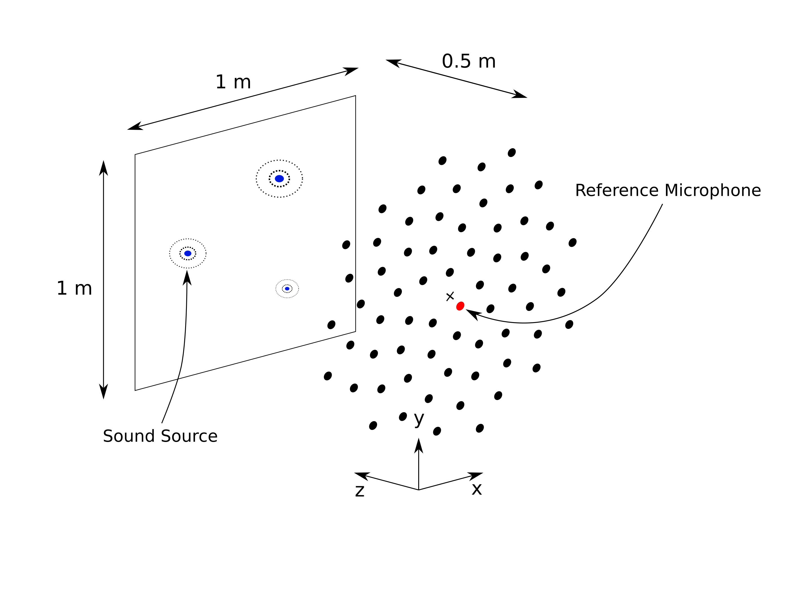

.. _dataset_synthetic:

DatasetSynthetic
================

``DatasetSynthetic`` is a purely synthetic microphone array source case generator. It relies on synthetic source signals from which the features are extracted and has been used in different publications, e.g. :cite:`Kujawski2019`, :cite:`Kujawski2022`, :cite:`Feng2022`. The default virtual simulation setup considers a 64 channel microphone array and a planar observation area, as shown in the figure below.

   Default measurement setup used in the :mod:`acoupipe.datasets.synthetic` module.

Default environmental properties
--------------------------------

.. table:: Default Environmental Characteristics

    ===================== ========================================
    Environment           Anechoic, Resting, Homogeneous Fluid
    Speed of sound        343 m/s
    Microphone Array      Vogel's spiral, :math:`M=64`, Aperture Size 1 m
    Observation Area      x,y in [-0.5,0.5], z=0.5
    Source Type           Monopole
    Source Signals        Uncorrelated White Noise (:math:`T=5\,s`)
    ===================== ========================================

Default FFT parameters
----------------------

The underlying default FFT parameters are:

.. table:: FFT Parameters

    ===================== ========================================
    Sampling Rate         He = 40, fs=13720 Hz
    Block size            128 Samples
    Block overlap         50 %
    Windowing             von Hann / Hanning
    ===================== ========================================

Randomized properties
---------------------

Several properties of the dataset are randomized for each source case when generating the data. Their respective distributions are closely related to :cite:`Herold2017`. As such, the microphone positions are spatially disturbed to account for uncertainties in the microphone placement. The number of sources, their positions, and strength are randomly chosen. Uncorrelated white noise is added to the microphone channels by default.

.. table:: Randomized properties

    ==================================================================   ===================================================
    Sensor Position Deviation [m]                                        Bivariate normal distributed (:math:`\sigma = 0.001)`
    No. of Sources                                                       Poisson distributed (:math:`\lambda=3`)
    Source Positions [m]                                                 Bivariate normal distributed (:math:`\sigma = 0.1688`)
    Source Strength (:math:`[{Pa}^2]` at reference position)               Rayleigh distributed (:math:`\sigma_{R}=5`)
    Relative Noise Variance                                              Uniform distributed (:math:`10^{-6}`, :math:`0.1`)
    ==================================================================   ===================================================

Example
-------

.. code-block:: python

    from acoupipe.datasets.synthetic import DatasetSynthetic

    dataset = DatasetSynthetic()
    dataset_generator = dataset.generate(
        features=['sourcemap', 'loc', 'f', 'num'],  # choose the features to extract
        f=[1000, 2000, 3000],  # choose the frequencies to extract
        split='training',  # choose the split of the dataset
        size=10,  # choose the size of the dataset
    )

    # get the first data sample
    data = next(dataset_generator)

    # print the keys of the dataset
    print(data.keys())

The generator yields one sample at a time as a dictionary. It includes the chosen features and the helper fields ``idx`` (sample index) and ``seeds`` (random seeds) for reproducibility in multi-processing scenarios.

API reference: :class:`acoupipe.datasets.synthetic.DatasetSynthetic`
