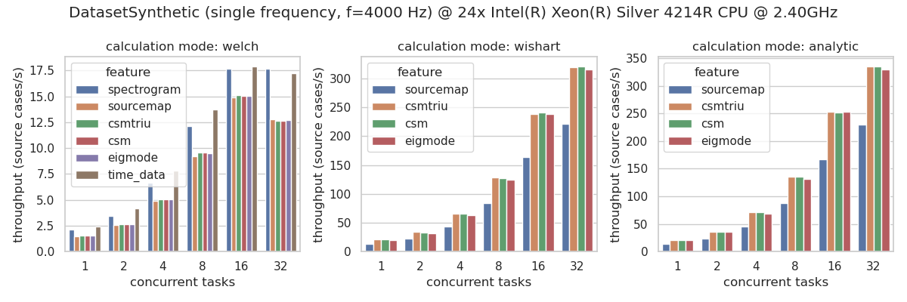
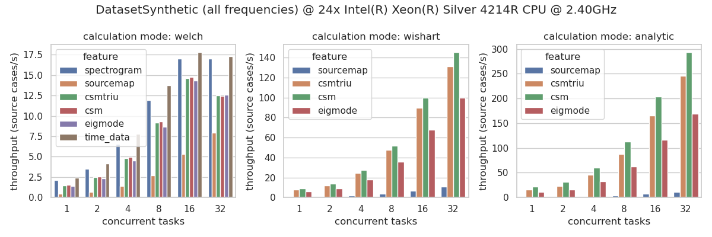
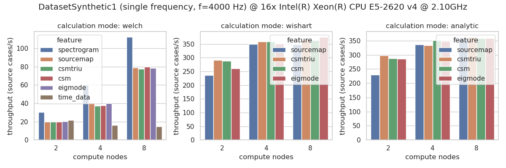

================================================================================
AcouPipe
================================================================================

**AcouPipe** :cite:`Kujawski2023` is a Python toolbox for generating microphone array data with Acoular_ :cite:`Sarradj2017` that can be used for training of deep neural networks and other machine learning approaches for acoustic source localization and characterization. 

.. toctree::
   :maxdepth: 1
   :caption: Contents

   contents/install.rst
   contents/datasets.rst
   contents/examples.rst
   contents/lit.rst
   AcouPipe API <../autoapi/acoupipe/index>

Data Generation 
===============

AcouPipe supports distributed computation with Ray_ and comes with three default datasets, which enable on-the-fly data generation for machine learning! 

.. list-table::
   :widths: 1 1 1
   :align: center

   * - .. image:: _static/msm_layout.png
          :width: 100%
          :alt: DatasetSynthetic measurement setup
     - .. image:: _static/msm_miracle.png
          :width: 100%
          :alt: DatasetMIRACLE measurement setup
     - .. image:: _static/sriracha_t60-measurement.jpg
          :width: 100%
          :alt: DatasetSRIRACHA measurement setup
   * - **DatasetSynthetic**
     - **DatasetMIRACLE**
     - **DatasetSRIRACHA**

* **DatasetSynthetic** is a simple and fast method that relies on synthetic white noise signals and spatially stationary sources in anechoic conditions. This dataset has been used in the following publications: :cite:`Kujawski2019`, :cite:`Kujawski2022`, :cite:`Feng2022`.

* **DatasetMIRACLE** relies on a large-scale set of measured spatial room impulse responses, acquired at the TU Berlin anechoic chamber :cite:`Kujawski2024`, and synthetic source signals, resulting in a realistic dataset with a quasi-infinite number of unique samples.

* **DatasetSRIRACHA** relies on measured room impulse responses from a shoebox room with varying absorption coefficients :cite:`Pelling2025`, enabling dataset generation under reverberant conditions with controllable acoustic properties.

See the latest performance benchmarks on `DatasetSynthetic` for the most computationally demanding features. A description of the features can be found :ref:`here <features>`.

Depending on the computational complexity of the feature extraction task, dataset generation can even be distributed over multiple machines. Note that this is only useful if the extraction task is computationally demanding and the data that needs to be transferred between the nodes is not too large.
The following figure shows the speedup of the dataset generation for the `DatasetSynthetic` dataset on multiple compute nodes, each of which has 16 physical cores:

Citation 
========

Users can cite the package in their contributions by referring to :cite:`Kujawski2023`.
Here is an example citation in BibTeX format:

.. code-block:: bibtex

   @article{Kujawski2023,
   author = {Kujawski, Adam and Pelling, Art J. R. and Jekosch, Simon and Sarradj, Ennes},
   title = {A framework for generating large-scale microphone array data for machine learning},
   journal = {Multimedia Tools and Applications},
   month = sep,
   number = {11},
   pages = {31211--31231},
   volume = {83},
   year = {2023},
   doi = {10.1007/s11042-023-16947-w},
   issn = {1573-7721},
   url = {https://link.springer.com/10.1007/s11042-023-16947-w},
   }

When using the MIRACLE dataset (:class:`~acoupipe.datasets.experimental.DatasetMIRACLE`), please also cite :cite:`Kujawski2024`:

.. code-block:: bibtex

   @article{Kujawski2024,
   author = {Kujawski, Adam and Pelling, Art J. R. and Sarradj, Ennes},
   title = {{MIRACLE} -- {A} {Microphone} {Array} {Impulse} {Response} {Dataset} for {Acoustic} {Learning}},
   journal = {EURASIP Journal on Audio, Speech, and Music Processing},
   pages = {1--16},
   doi = {10.1186/s13636-024-00352-8},
   year = {2024},
   }

When using the SRIRACHA dataset (:class:`~acoupipe.datasets.experimental.DatasetSRIRACHA`), please also cite :cite:`Pelling2025`:

.. code-block:: bibtex

   @misc{Pelling2025,
   author = {Pelling, Art J. R. and Kujawski, Adam and Sarradj, Ennes},
   month = jul,
   publisher = {Technische Universit\"at Berlin},
   title = {{SRIRACHA}: {Shoebox} {Room} {Impulse} {Response} {Archive} with {Varying} {Absorption}},
   year = {2025},
   doi = {10.14279/DEPOSITONCE-23943},
   url = {https://depositonce.tu-berlin.de/handle/11303/25123},
   }

License
=======

AcouPipe is licensed under the terms of the BSD license. See the file "LICENSE" for more information.

